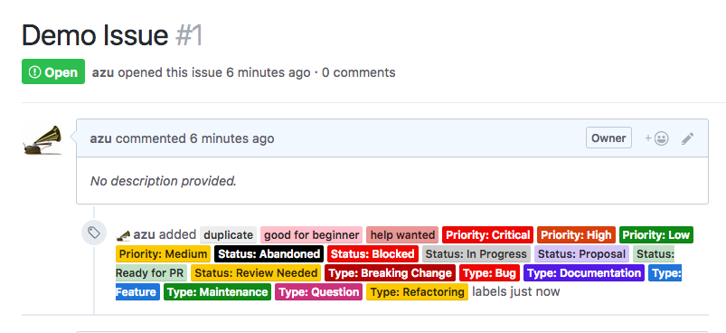

# @azu/github-label-setup

Opinionated GitHub label setup tool.

- Create starter GitHub labels
- Migrate existing labels
- No configuration - It is opinionated

## Install

Install with [npm](https://www.npmjs.com/):

    npm install @azu/github-label-setup -g

## Usage

This tool work without no configuration.

    Usage
      $ github-label-setup --token xxx

    Options

      -h, --help                  output usage information
      -l, --labels <path>         the path or npm packages name to look for the label configuration in. Default: labels.json
      --token <token>  a GitHub access token (also settable with a GITHUB_ACCESS_TOKEN environment variable)
      -d, --dry-run               calculate the required label changes but do not apply them

You'll also need a GitHub access token ready so that the the tool will have access to your repositories.
You can [generate an access token here](https://github.com/settings/tokens), be sure to allow the `"repo"` scope.

This tool is wrapper of `github-label-sync`.

- [Financial-Times/github-label-sync: Synchronise your GitHub labels with as few destructive operations as possible](https://github.com/Financial-Times/github-label-sync "Financial-Times/github-label-sync: Synchronise your GitHub labels with as few destructive operations as possible")

### Npm packages for labels

labels can be set `require`able path like npm packages.

    $ github-label-setup --token xxx --labels @owner/github-label-presets

See [Label JSON](https://github.com/Financial-Times/github-label-sync#label-json "Label JSON") format.

## Default Labels

That is opinionated labels. 

- duplicate
    - Duplicated issue
- help wanted
    - help/need idea issue
- good first issue
    - Easy to fix issue
    - [MunGell/awesome-for-beginners: A list of awesome beginners-friendly projects.](https://github.com/MunGell/awesome-for-beginners "MunGell/awesome-for-beginners: A list of awesome beginners-friendly projects.")
- Priority: Critical
- Priority: High
- Priority: Low
- Priority: Medium
- Status: Abandoned
- Status: Blocked
- Status: In Progress
- Status: Proposal
- Status: PR Welcome
- Status: Review Needed
- Type: Breaking Change
- Type: Bug
- Type: Feature
- Type: Documentation
- Type: Refactoring
- Type: Maintenance
    - Type is related with [Conventional Commits](https://conventionalcommits.org/ "Conventional Commits")'s type
- Type: Question

## Related

- [yoshuawuyts/github-standard-labels: Create a standard set of issue labels for a GitHub project](https://github.com/yoshuawuyts/github-standard-labels "yoshuawuyts/github-standard-labels: Create a standard set of issue labels for a GitHub project")
- [Financial-Times/github-label-sync: Synchronise your GitHub labels with as few destructive operations as possible](https://github.com/Financial-Times/github-label-sync "Financial-Times/github-label-sync: Synchronise your GitHub labels with as few destructive operations as possible")
- [MunGell/awesome-for-beginners: A list of awesome beginners-friendly projects.](https://github.com/MunGell/awesome-for-beginners "MunGell/awesome-for-beginners: A list of awesome beginners-friendly projects.")
- [himynameisdave/git-labelmaker: Manage your GitHub labels from the command line!](https://github.com/himynameisdave/git-labelmaker "himynameisdave/git-labelmaker: Manage your GitHub labels from the command line!")
- [Sane GitHub Labels – Dave Lunny – Medium](https://medium.com/@dave_lunny/sane-github-labels-c5d2e6004b63 "Sane GitHub Labels – Dave Lunny – Medium")

## Changelog

See [Releases page](https://github.com/azu/github-label-setup/releases).

## Running tests

Install devDependencies and Run `npm test`:

    npm i -d && npm test

## Contributing

Pull requests and stars are always welcome.

For bugs and feature requests, [please create an issue](https://github.com/azu/github-label-setup/issues).

1. Fork it!
2. Create your feature branch: `git checkout -b my-new-feature`
3. Commit your changes: `git commit -am 'Add some feature'`
4. Push to the branch: `git push origin my-new-feature`
5. Submit a pull request :D

## Author

- [github/azu](https://github.com/azu)
- [twitter/azu_re](https://twitter.com/azu_re)

## License

MIT © azu
